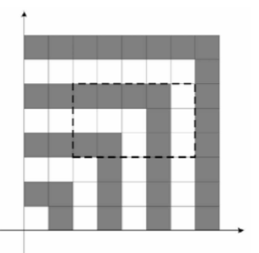

# Statement

On the Oxy plane, there is a square of size 1000, with 4 vertices at 4 points: (0, 0), (0, 1000), (1000, 0) and (1000, 1000). We color the regions inside the square like below:



Consider a rectangle with opposite corners at (X1, Y1) and (X2, Y2), where X1, Y1, X2, Y2 are integers. Obviously, this rectangle lies completely inside our given square.

Each pair of integer points: (X, Y) and (X+2, Y+2) (where X1 <= X < X+2 <= X2 and Y1 <= Y <= Y+2 <= Y2) forms a 2*2 square that lies completely inside this rectangle. Count the number of 2*2 squares that contains 2 black cells and 2 white cells.

For example, consider the rectangle with opposite corners (2, 3) and (7, 6) (marked with dash-line in the figure above). It contains six 2*2 squares containing 2 black cells and 2 white cells:

- (2, 3) - (4, 5)
- (4, 3) - (6, 5)
- (5, 3) - (7, 5)
- (2, 4) - (4, 6)
- (3, 4) - (5, 6)
- (5, 4) - (7, 6)

# Constraints:

- 0 <= X1, Y1, X2, Y2 <= 1000.

# Input
- 1st line: T - number of test cases.
- Next T lines: each line contains X1, Y1, X2, Y2

# Output
- For each test case, print the result

# Example
## Input
```
1
2 3 7 6
```

## Output
```
6
```
