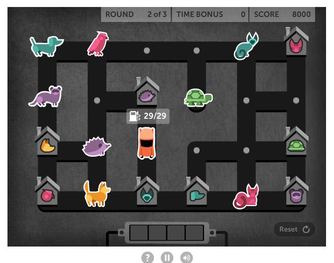
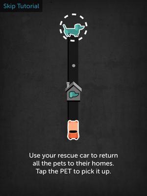

# Statement

In this problem, you need to find solution to a puzzle game named "Pet detective".



The game is played in a field with M rows and N columns. The rows are numbered with 1 to M, from the top to bottom, and the columns are numbered from 1 to N from left to right. The cell in i-th row and j-th column is denoted as cell (i, j). For example, the pink bird in the above figure is in cell (1, 2).

Your mission is to drive the car (located in cell (3, 3) in the above figure) around the field, pick up the animals and return them to their home. You have the following restrictions:
- You must use the shortest route.
- You can only move in 4 directions (up, down, left, right), and you can only moves between cells having road between them (in above figure, the roads are highlighted in black)
- At each moment, your car can only have at most 4 animals.
- You must return each animal to their correct home. For example, the pink bird in cell (1, 2) must be returned to cell (4, 1).

## Example 1:



In this example, M = 4, N = 1. You start at cell (4, 1) and need to return the dog at cell (1, 1) to his home at (3, 1). The shortest route is:
- Go from (4, 1) to (1, 1) and pick up the dog. Length = 3.
- Go from (1, 1) to (3, 1), return the dog to his home. Length = 2.
So the shortest route has length = 5.

## Example 2:

[!Example 2](./IMG_1589.PNG)

M = 4, N = 3.
- You start at cell (3, 1), and need to:
  - Get dog at (4, 1) to (1, 3)
  - Get cat at (4, 2) to (1, 2)
  - Get hedgehog at (4, 3) to (1, 1)
  - Get turtle at (3, 3) to (2, 1).
The shortest route is:
- Go from (3, 1) to (4, 1), pick up dog --> length = 1
- Go from (4, 1) to (4, 2), pick up cat --> length = 1
- Go from (4, 2) to (4, 3), pick up hedgehog --> length = 1
- Go from (4, 3) to (3, 3), pick up turtle --> length = 1
- Go from (3, 3) to (1, 3), return turtle --> length = 2
- Go from (1, 3) to (1, 2), return cat --> length = 1
- Go from (1, 2) to (1, 1), return hedgehog --> length = 1
- Go from (1, 1) to (2, 1), return turtle --> length = 1
Total length of route is 9.

Note that after picking up turtle, the car is carrying 4 animals, which is the maximum capacity of the car. At this point, the car cannot pickup any animal. But after returning dog to his home, the car has 3 animals, and can pick up another animal if needed.

# Constraints:
- 1 <= M, N <= 6.
- Let K be the number of animals. K is at most 11.
- There is at most 1 animal of each type (there is at most 1 dog, at most 1 cat, at most 1 turtle...)

# Input:
- 1st line: M, N
- In the next M lines, each line contains N integers describing the field. Each integer can be one of the following:
  - 99: if the corresponding cell is the car. There is only one cell with value equal to 99.
  - 0: if the corresponding cell is empty
  - 1..K: if the corresponding cell has an animal. The animals are numbered from 1 to K. Each of these numbers occur at most once.
  - -1 .. -K: if the corresponding cell is an animal's home. Each of these numbers occur at most once.
- In the next M lines, each lines containing N-1 integers, representing the horizontal roads of the field.
  - The number at (i, j) is equal to 1 if there is road between (i, j) and (i, j+1).
  - Otherwise, it is 0.
- In the next M-1 lines, each line containing N integers, representing the vertical roads of the field.
  - The number at (i, j) is equal to 1 if there is road between (i, j) and (i+1, j).
  - Otherwise, it is 0.

Note: there can be extra spaces and/or empty lines anywhere in the input file.

# Output:
Print a single integer, which is the shortest length of your route. It is guaranteed that a solution exist.

# Example:
## Input 1
```
4 1
1
0
-1
99


1
1
1
```
## Output 1
```
5
```

## Input 2
```
4 3
-1 -2 -3
-4  0  0
99  0  4
 3  2  1

1 1
0 0
0 0
1 1

1 0 1
0 0 1
1 0 1
```

## Output 2
```
9
```
