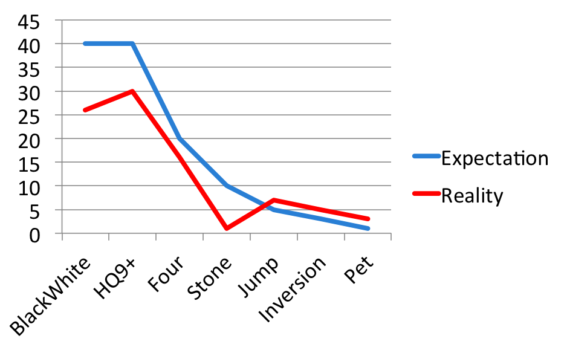

PayPal Codechallenge 2015 - Solutions
-------------------------------------

# Overview

## Contestants

In the figure below, you can find the number of participants who attempted at least one problem, who solved 1 problem, 2 problems, ... The blue line represents our expectation, and the red line represents the actual numbers.
As you can see, there are around 50 contestants who attempted at least one problem. We expected the winner to solve all 7 problems, and around 2-3 contestants to solve 6. But in reality, the winners only solved 5 problems. :(


Winners:
- 1st prize: Nathan Azaria (NUS)
- 2nd prize: Jonathan Irvin Gunawan (NUS)
- 3rd prize: Nguyen Tan Sy Nguyen (NUS)
- 4th prize: Bui Do Hiep (NUS)
- 5th prize: Nguyen Tuan Anh (NTU)

Congratulations to our winners.

## Problems

Below you can see number of participants who correctly solved each problem. Each problem was solved by at least one participant, meaning all of them are solvable during contest time! We expected problem "Moving Stone" to be relatively easy, and would be solved by around 10 contestants, but in reality, only 1 contestant successfully solved it.



## Where to find our solutions?

You can find the complete code for all problems, as well as the input & output files for each problem in [My Github repo](https://github.com/ngthanhtrung23/PPCodeChallenge).

# Black & White

## Solution
This is the easiest problem in the problemset.

First of all, notice that except for the `2*2` squares having 2 corners lying at the line `y=x`, all the `2*2` squares have 2 black cells and 2 white cells.

Thus, to solve this problem, you only need 2 simple for loops, going through every `2*2` cells. Below is my Python code.

```python
for i in xrange(x1, x2-1):
    for j in xrange(y1, y2-1):
            if i != j:
                res += 1

```

## Complexity

The complexity of the explained solution is `O(X^2)` where X is the maximum coordinates, which in our case is 1000.

There is also a solution with complexity `O(1)`. Can you try to find it? :)

## Trap

Even though this is the easiest problem, you must still be careful of traps. In this problem, the trap is the case: `X1 > X2` or `Y1 > Y2`.

# HQ9+

## Solution

This is the 2nd easiest problem in the problemset. You just need to implement what asked in the problem statement:

- Loop through each character of the program
- Check if the current character is a valid command, and then process it.

This is a [real programming language](http://esolangs.org/wiki/HQ9+), though it is a joke language and is not practical in any way. Also, the `+` operator doesn't do anything.


## Complexity

The complexity of this solution is `O(L)`, where L is the length of the program.

## Traps

In this problem, there are a couple of traps:

- The program can contain whitespace in the middle, so if you use C++ and use `cin` or `scanf`, you may probably read input wrong.
- You must be careful when to put `s` in the end of `bottle`. When the number of bottle is 1, you must not print `s`.

# Four

## Solution

### Brute Foce solution

First, I will explain a brute force solution. This will be helpful, because the idea will still be used in the later solution.

The most simple solution is as follows:

- Maintain an array `count`, where `count[S]` is the number of quadruples with sum S.
- Loop through all quadruples of 4 elements. Let's call them x, y, z and w.
- For each quadruples, increase the count of the sum of this quadruples.

Below is my code in Python:

```python
for x in a:
	for y in a:
		for z in a:
			for w in a:
				count[x + y + z + w] += 1

```

This solution has complexity `O(N^4)` where N is the number of elements of array A. This solution is too slow and cannot run in the given time limit.

### Divide and Conquer solution

In order to solve this problem, you must improve the brute force solution using Divide & Conquer technique, which is a very useful technique in computer science.

- First, split the 4 numbers into 2 pairs (x, y) and (z, w).
- Second, count how many pair (x, y) sums up to a value. We will use the same technique as the brute force solution:

```python
for x in a:
	for y in a:
		count2[x + y] += 1
```

- Next, to count how many quadruples sums to a certain value, we loop through the sum of pair (x, y) and the sum of pair (z, w), and use the similar technique to update the count of the quadruples:

```python
for sum_xy in xrange(1, 2*n+1):
	for sum_zw in xrange(1, 2*n+1):
		count4[sum_xy + sum_zw] += count2[sum_xy] * count2[sum_zw]

```

### Complexity

The complexity of this solution is `O(N^2)`, which should be fast enough to pass all test cases.

# Moving Stone

## Solution

This problem can be solved with a very simple greedy algorithm.

Note that, for a solution to exist, the total number of stones, S, must be divisible by the number of boxes, N.

The greedy algorithm goes like this: We go through the boxes one by one, from left to right:

- If current box have too many stones --> we must move the extra ones to the box on our right.
- If current box do not have enough stone --> we must get the missing ones from the box on our right.
- But what if the box on our right does not have enough stone? The trick is to allow the number of stones to be negative.

Let's take a look at an example to better understand this:

In this example, we have 6 boxes, the box in the middle have 600 stones, like following:

```
+---+---+---+-----+---+---+
| 0 | 0 | 0 | 600 | 0 | 0 |
+---+---+---+-----+---+---+
```

In the end, each box must have 100 stones. Let's go from left to right:

- First, we're at the 1st box. Since it doesn't have any stone, we must borrow 100 stone from the 2nd box. Then the amount of stones in each box becomes as follow:

```
+-----+------+---+-----+---+---+
| 100 | -100 | 0 | 600 | 0 | 0 |
+-----+------+---+-----+---+---+
```
- Now we're at 2nd box. Since it now have -100 stones, we must borrow 200 stones from the 3rd box:

```
+-----+-----+------+-----+---+---+
| 100 | 100 | -200 | 600 | 0 | 0 |
+-----+-----+------+-----+---+---+
```

- We're at the 3rd box, and it has -200 stones. Thus we must borrow 300 stones from the 4th box, and our configuration becomes as follows:

```
+-----+-----+-----+-----+---+---+
| 100 | 100 | 100 | 300 | 0 | 0 |
+-----+-----+-----+-----+---+---+
```

- Next, we're at the 4th box. This box has 300 stones, which is too many. Thus, we must move 200 stones to the 5th box:

```
+-----+-----+-----+-----+-----+---+
| 100 | 100 | 100 | 100 | 200 | 0 |
+-----+-----+-----+-----+-----+---+
```

- Finally, we're at the 5th box. Since this box has 200 stones, we must move 100 stones to the last box:

```
+-----+-----+-----+-----+-----+-----+
| 100 | 100 | 100 | 100 | 100 | 100 |
+-----+-----+-----+-----+-----+-----+
```

And we're done. The answer is the maximum number of stones that we either borrowed from the right, or move to the right, which is equal to: 

`max(100, 200, 300, 200, 100) = 300`

Why is this solution correct?

- Since we can move stones at the same time, it should be maximum values (amongst the number of stones that we moved or borrowed).
- What about negative values? If a move make the number of stones negative, we can delay this move until later. Since we only care about the maximum value, this delaying will not affect our answer.

Following is the main part of my very simple code in Python:

```python
l = 0    # stones borrow from right
r = 0    # stones move to right
for i in xrange(n):
	a[i] += r - l
	if a[i] > final_amount:
		l = 0
		r = a[i] - each
	else:
		l = each - a[i]
		r = 0
	res = max(res, max(l, r))
```

## Complexity

The complexity of this algorithm is `O(N)`, where N is the number of boxes.

# Pet Detective

## Overview

This problem is based on an actual game, [Pet Detective - Lumosity](https://www.youtube.com/watch?v=fUwKBR_Ip5E).

The solution for this problem is to use shortest path on graph.

## Graph Construction

First, we need to construct the graph as following:

- Each node in the graph will represent a state of the game, and thus it will need to  encode the following information:
	- The current position of the car.
	- Which pets are currently on the car.
	- Which pets are currently returned to their home.
- We have an edge between 2 nodes, if we can move between the corresponding state of the game. We have 3 types of moves between the states of the game, and thus 3 types of edges:
	- Move the car to a new position
	- Pick up a pet to our car
	- Return a pet in our car to his home.

Note that, in order to use the 2nd and 3rd moves, we must be at the place containing the pet or at his home.

How to store this graph? In my code, I represent each node of the graph with 3 integers, representing:

- The row of the the current position of the car
- The column of hte current position of the car
- A base-3 number, which encode the states of the pets: Each digit represents a pet:
	- The corresponding digit is 0 if the pet is not picked up by the car
	- The corresponding digit is 1 if the pet is currently in the car
	- The corresponding digit is 2 if the pet is already returned to his home.

## Path Finding

So now the problem becomes finding shortest path in a graph, which can be solved in multiple ways:

- [Dijkstra algorithm](http://en.wikipedia.org/wiki/dijkstra's_algorithm).
	- This solution has complexity `O(M*log(N))` where M is the number of edges, and N is the number of states. This is a bit too slow to solve the problem, and you need to make some optimizations in order to pass all test cases. Some possible optimizations are:
		- Only consider the positions with pets / homes
		- Use A*: implement a heuristic to estimate how many moves we still need to return the remaining pets to his home.
	- During the contest, there was one participant who solved this problem using this approach.
- [BFS](http://en.wikipedia.org/wiki/Breadth-first_search):
	- In this graph, we only have 2 types of edges:
		- If you pick up pet or return him to his home: weight = 0
		- If you move the car: weight = 1
	- Thus, you can solve this problem using a modified version of BFS, using a double ended queue. You can read discussion about this algorithm [here](http://codeforces.com/blog/entry/6455)
	- There were 2 contestants who solved this problem using this approach

